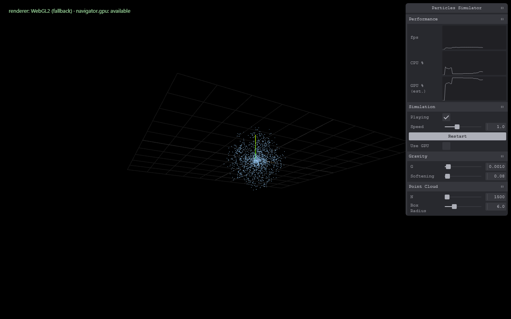

# Particles Simulator

A 3D N-body particle physics simulator running in the browser — gravity today, with elastic/inelastic collisions, heating & radiation, and a dark matter species planned as the project progresses. Built with TypeScript, Three.js (`WebGPURenderer` + TSL), and Tweakpane.



## What it does right now

- Up to tens of thousands of particles, self-gravitating from a cold, uniform cloud
- Softened Newtonian gravity via a fine+coarse uniform grid (not brute-force O(N²)), so it scales past a few thousand particles while staying interactive
- Live-adjustable gravity constant, softening length, particle count, and simulation box size — no restart required
- Play/pause, speed control, and a one-click restart
- A CPU/GPU frame-time breakdown alongside FPS, so you can see where the time actually goes
- An experimental GPU compute backend (toggle "Use GPU" in the panel) — requires a browser with a real WebGPU adapter; falls back to CPU automatically otherwise

This is a learning project built incrementally in milestones. See **[docs/devplan.md](docs/devplan.md)** for the full roadmap, current progress, and the physics/engineering bugs found and fixed along the way — worth a read before changing the gravity or grid code, since a couple of "obvious" fixes turned out to trade one bug for another.

## Getting started

Requires Node.js.

```bash
npm install
npm run dev
```

Then open the printed `http://localhost:5173` URL in a browser. A browser with WebGPU support (recent Chrome/Edge, or Safari/Firefox per their current rollout) will show `renderer: WebGPU` in the top-left status line; otherwise it falls back to WebGL2 automatically (rendering still works — only the experimental GPU compute toggle is affected).

### Other commands

```bash
npm run build   # type-check + production build
npm test        # run tests once (vitest)
```

## Controls

Everything is in the panel on the right:

- **Performance** — FPS, and a CPU%/GPU% frame-time estimate (browsers don't expose real GPU utilization to JS, so this is a proxy, not a literal hardware reading)
- **Simulation** — play/pause, speed multiplier, restart, and the GPU/CPU backend toggle
- **Gravity** — the gravitational constant `G` and the softening length (prevents force blow-ups at very close range)
- **Point Cloud** — particle count `N` and the simulation box radius

## Tech stack

TypeScript, Vite, Three.js `WebGPURenderer`/TSL for rendering and (experimentally) GPU compute, Tweakpane for the control panel, Vitest for physics/math regression tests.
